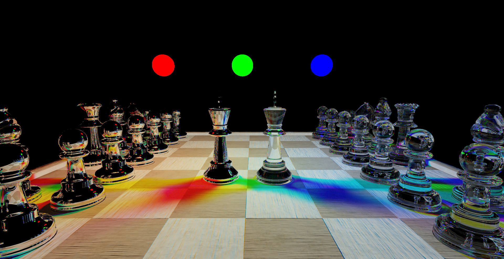

# VUT-FIT-PGR-RT
PGR and GMU project. Chess rendered using wavefront path tracing.

# Building
Clone this repository and use:
git submodule update --init --recursive
to clone all required libraries.
Then just use CMake for compiling.

# Some Renders

